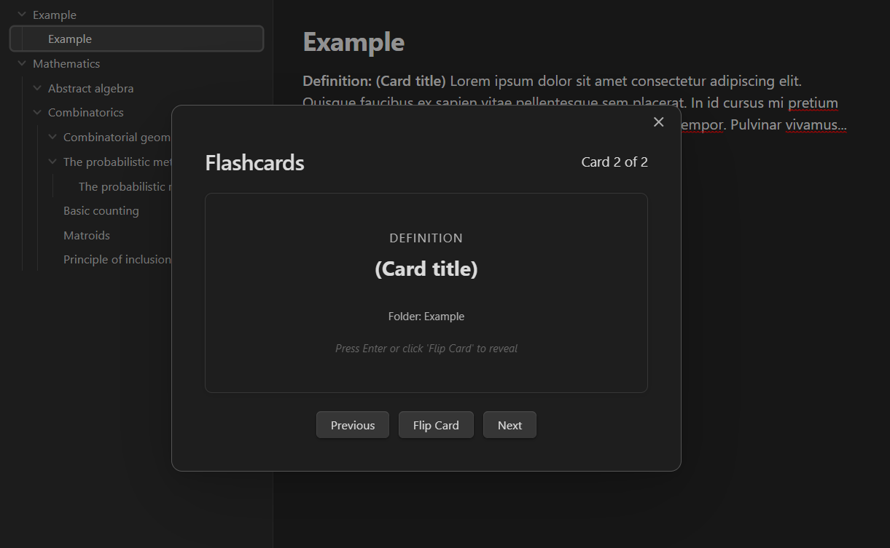
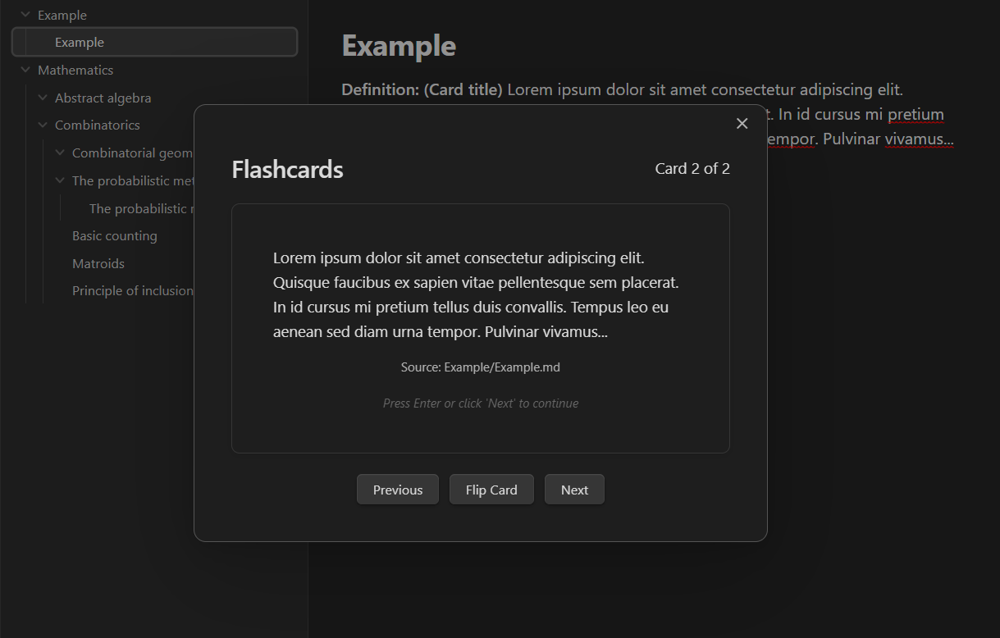

# Obsidian keyword flashcards

This repository contains code for building a Obsidian plugin that automatically
generates random flashcards from .md blocks within your vault that begin with the
specific keywords/phrases:

```md
**Definition: (Card title)** Lorem ipsum dolor sit amet consectetur adipiscing elit.
Quisque faucibus ex sapien vitae pellentesque sem placerat. In id cursus mi pretium 
tellus duis convallis. Tempus leo eu aenean sed diam urna tempor. Pulvinar vivamus...
```

```md
**Theorem: (Card title)** Lorem ipsum dolor sit amet consectetur adipiscing elit.
Quisque faucibus ex sapien vitae pellentesque sem placerat. In id cursus mi pretium 
tellus duis convallis. Tempus leo eu aenean sed diam urna tempor. Pulvinar vivamus...
```

The constructed cards take the following form (using the same example as above):

<p align="center">

</p>

<p align="center">

</p>


# Installation and setup
Begin by git-cloning this repository to a development folder where you have `npm` 
configured. Then run a build of the project using 

```bash
npm run build
```

This will create a few project files that need to be copied into your Obsidian 
plugin directory. Namely, create the following folder and copy the listed files 
within your `.obsidian` vault folder

```md
.obsidian/plugins/obsidian-keyword-flashcards/
├── main.js       (compiled JavaScript from build)
├── manifest.json
└── styles.css
```

This should be all that you need to do.


# Related projects
This project was inspired by [obsidian-spaced-repetition](https://github.com/st3v3nmw/obsidian-spaced-repetition)
which offers a much more expansive/configurable extension for flashcard creation. 
However, I found -- either due to the lack of clear documentation of my own floundering -- this
package both too feature rich and also missing the basic functionality I wanted. As most of
my notes are for topics in Mathematics and Computer Science they are notation heavy and rigidly
formatted (e.g., I always state definitions as a block to make them easy to link to), but there 
was no clear way to get this package to pull out these blocks of text from my preexisting notes. 
Hence, why I wanted to create this minimal plugin to serve my tiny niche.  


# Code attribution 
This repository is built and maintained by Spencer Szabados.